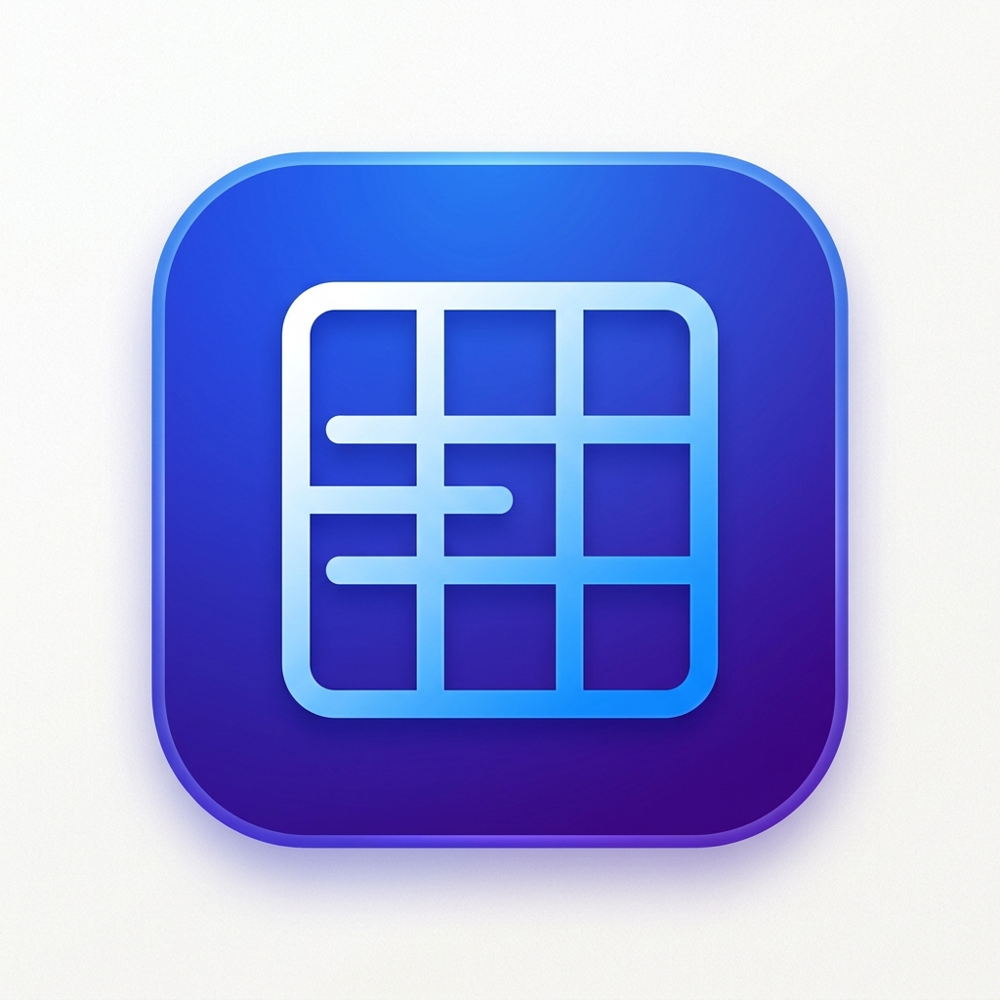
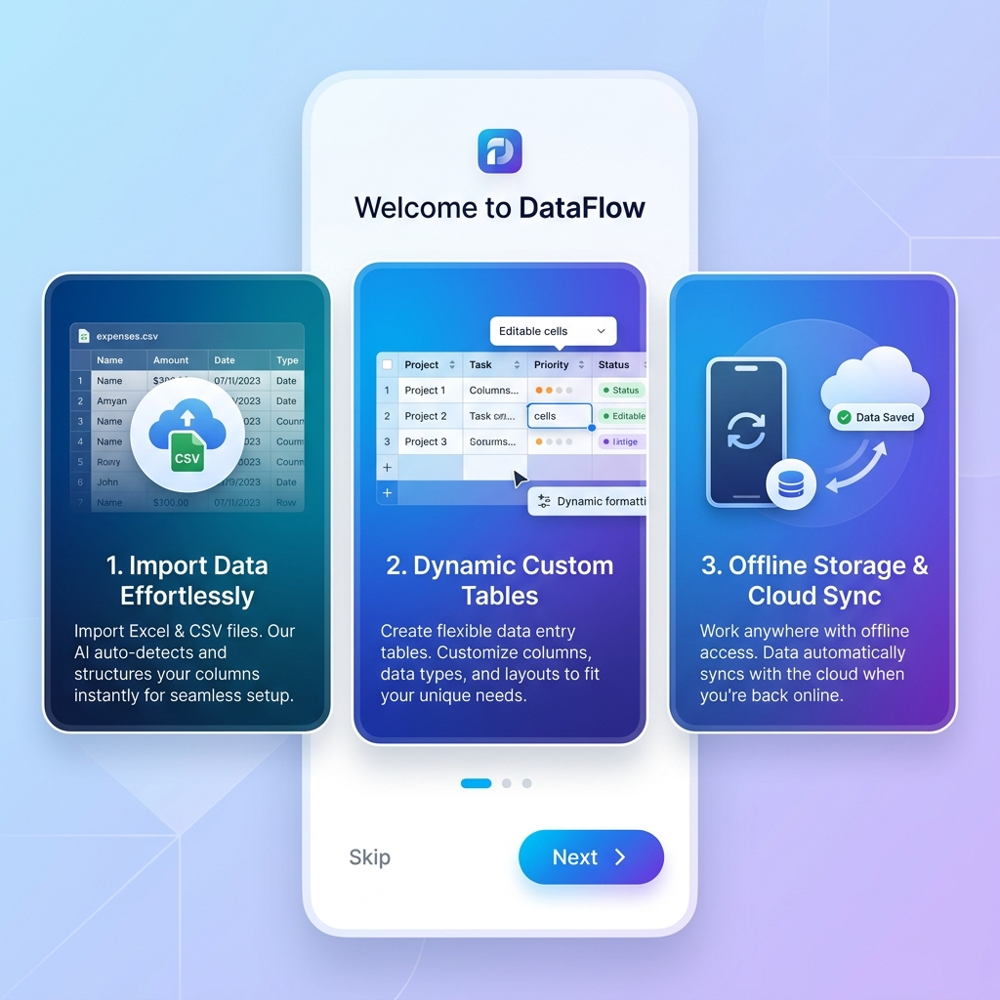

# SmartEntry Mobile App



SmartEntry is a Flutter application for building and importing structured data projects with Firebase authentication and Cloud Firestore storage.


## Features

- Onboarding experience for new users
- Email/password authentication via Firebase Auth
- Create and manage schema-driven data files
- Import CSV data and define custom columns
- Store project schema and records in Firestore
- Responsive layout for mobile and larger screens

## Prerequisites

- Flutter SDK compatible with Dart 3.11.5
- Android Studio / Xcode or another supported Flutter development environment
- Firebase project with Android/iOS app settings

## Setup

1. Open the project in your editor.
2. Run:

```bash
flutter pub get
```

3. Ensure Firebase configuration files are present:

- `android/app/google-services.json`
- `ios/Runner/GoogleService-Info.plist`

4. If needed, configure Firebase for your project using the FlutterFire CLI or the Firebase console.

## Run

Start the app on a connected device or emulator:

```bash
flutter run
```

To build a release APK:

```bash
flutter build apk
```

## Notes

- The app relies on `firebase_core`, `firebase_auth`, and `cloud_firestore`.
- Example assets are loaded from `assets/logo.png`.
- Supported import formats include CSV and Excel data handling.
